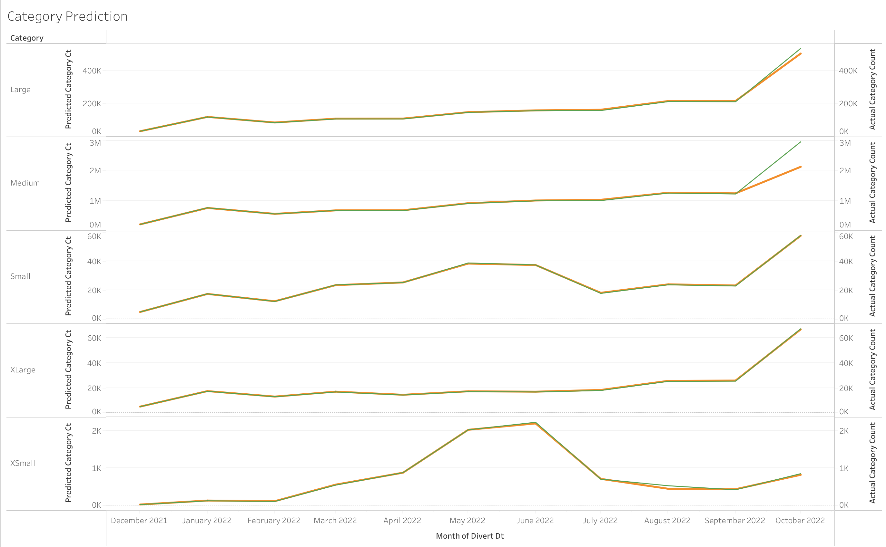

# Seasonality Package Sorter Optimization for Amazon AIR

Chia Jung Tsou ctsou8@gatech.edu

**Abstract**

The objective of this project is to develop a system where stakeholders can adjust accordingly the sorter machine based on different seasons (peak vs non-peak). The goal is to optimize the throughput of the package going through the conveyor belt that gets ready for shipment. Even though there are two sorters to focus on: small primary sorters 10 (SPS10) and Outbound High Velocity 1 Sorter (HV1). I will just focus on SPS10 as the data for this is more complete and similar concept can be applied to HV1.

**1 INTRODUCTION AND MOTIVATION**

Amazon sortation centers are rated based on ideal package throughput per hour. This can be affected by the building design and machines installed.

The actual throughput will vary based on machine downtime, operational efficiencies, package size, package weight, etc. A variable that can be monitored and adjusted for is average package dimensions. This project focuses on impact of seasonal changes in average package size in Amazon’s largest Air Hub in its global shipping and fulfillment network.

The analysis will be performed on AIR site because it is one of the biggest site with about Four hundred thousand scans a day in non-peak time, and about Fivehundred and forty thousand scans a day in peak time. What the stakeholders are interested in is how the sorters can prepare for peak and non peak season to optimize the throughput. Peak season refers to Amazon Prime days and other major holidays where gift giving happens, such as Christmas. Non-peak seasons refer to seasons that does not fall into peak seasons defined earlier. Right now, the settings for the package size sorting is static. This approach is not flexible and the items would not be able to be scanned properly if there is not enough distance between packages on the sorting machine. Therefore, adjusting the setting for the package flow would benefit the organization greatly.

To summarize, peak and non-peak season has different flow for sort centers. For example, in the beginning of the peak season, the packages are often optimized in

the sense that orders to the same address would be placed in one big box. However, when it gets really busy towards the middle and end of the season, warehouse workers just want to get the packages out so the shape of package now comes in all sizes, and stakeholders want to ensure that sorters will be running at optimal efficiency for the highest possible throughput. While in non-peak season, there is less issue and packages can be sorted more easily.

This is an issue because if a package is not properly scanned for a certain amount of times,sorterwill send the package to a place where it will be human to examine the label and do the sorting manual. In peak season, this would impact the efficiency of the sorting and affect the customer experience.

The end goal is to be able to predict the package size mixture and inform the machine the amount of packages coming through. This way, the machine will be able to handle the incoming flow.

**2 RISK FACTOR**

**2.1 Definition of risk factor and how it is measured**

In this project , the risk factor is related to the packages arrival time. Even though the analysis is performed on the packages on seasonal basis, but when in peak time, when the packages arrive early or have delays via flight or trucking, this can affect the volume and package mix of the flow. Also, after packages arrive, it takes on average about three hours to unload, from the flight or truck to the sorting conveyor belt.

The risks are categorized into the following scenarios: First, When packages are early, the packages are simply unloaded and moved to sorter belt and start the sort- ing process along with the rest of the packages that are already on the sorter. This increases the sorter volume and potentially skewed the package mix as planned.

The second scenario is when the packages are delayed, and this can be further categorized into another two scenarios.

1. When the delayed flight arrive at the shift break
1. When the delayed flight arrive at after the last shift

For example, this is the promptness the sorter of the project focus, SPS10.

Those two scenarios while at the first glance should affect the sorter from hourly perspective, this can also affect it from seasonal perspective, just with lower impact. The impact is lower because even though the packages might arrive early or late, when it is inspected from a day to a month perspective, the shifting of the packages in the intra-day would not show up. However, in reality, this would still affect the sorter throughput. And as mentioned prior, this bottleneck can become a big issue if more packages are sent to human to examine and therefore severely impede the flow.

**3 PROPOSED METHOD**

1. **Intuition**

Since currently, the sorter settings are static, they expect the packages to come at a certain range of dimension and volume, and so it is not prepared for a influx of variation. This can cause issue in throughput efficiency.

2. **List of innovation**
- Providing explanations in why the sorting center, even though equipped with technologies and advanced machines, still failed at delivering at optimal outputs.
- Providing recommendation for package influx expectations
3. **Approach**
1. **Data gathering**

There are three primary datasets for this. See Appendix A for details.

Dataset 1 is the flight data. The flight data gives us details the planned vs actual arrival flights, along with the amount of packages each flight carries.

Dataset 2 is the Daily Package Data. This contains datasets forthe sorters interested in along with the dimensions. The data includes one week of data from each month

starting from January 2022 through October 2022. It also includes the full month of July 2022, this is to collect data before and after Prime day. This also tells us when the package was on the actual sorter and their unload time, so it can be tied back to flight data.

Dataset 3 is the container movement data. This contains data that shows movement of packages on and off the sorter. This is to visualize what was scanned successfully and what failed and why. This is where some investigation and problem solving can occur.

With these datasets, information related to package data, delayed or early or on time, with the package movement. This can achieve the deliverable in adjusting the expected package mix for different seasons.

2. **Data wrangling**

Dataset 2 needed the most cleaning. Dataset 2 has large amount of data, some are unusable. The data is deemed unusable for several reasons: 1) Not all data are collected and some sorters have under-represented data 2) The data recorded in the process is incorrect. For example, the package unload time is EARLIER than

the package arrival time. This is simply impossible. The way to deal with those data are 1) remove those data that does not make sense, 2) try to derive the unload time by adding three hours to the package arrival time if the dataset 1 and dataset 2 for the package arrival time align, and 3) Focus on packages that are within the year. After the issues are addressed, we can start the project. As dataset 3 data is clean.

3. **Data Analysis**

There are several analysis for the implementation. There are dozens of sorters in the center. The area of interests are two of the sorters specifically as those are the ones responsible for redirecting tons of volumes with enough data to dive deep into.

There are two steps to the analysis -

**Step 1: identify the package dimension grouping** The packages sizes are defined into five different categories for the lengths, widths, and heights. The categories are: XSmall, Small, Medium, Large, XLarge. Those package dimension variations are different for different sorters as well.

The two sorters focused on are small primary sorters 10 (SPS10) and Outbound High Velocity 1 Sorter (HV1).

I will implement an unsupervised machine learning algorithm, k-means clustering, to identify similarities among the package dimension data. Each dimension will be assigned to a cluster. Each dimension cluster will be different for different sorters. It will enable the calculation of the distribution of package flow mixture per sorter within a cluster, allowing us to identify the different package dimension mix and adjust the sorters setting accordingly.

**Algorithm 1** k-Means Algorithm

On top of the K-means clustering, data binning technique is also performed. It is a technique that reduce the cardinality. Reason for this is that K-means algorithm performs the cluster on all three dimensions to determine the sizing, but I also want to make sure that length, height, width are determined separately - to reduce correlation and bias. The based on the two outputs, I can look into them and distribute on a normal distribution and adjust the boundaries. The result looks promising as the trend aligns with the expectation for peak vs non peak package patterns.

**Step 2: Package mixture prediction** With the predefined classification of the pack- age mixtures ranging from XSmall, Small, Medium, Large, XLarge; it is time to make models on the package flow prediction based on the seasonality.

to predict seasonality volume and package mixture, I have decided that the su- pervised machine learning algorithm random forest regressor as ensembleis the best approach. The reason for this approach is because this is an estimator that fits

a number of decision tree classifiers on various sub-samples of the dataset and uses averaging to improve the predictive accuracy and control over-fitting. Even though the process is a bit of blackbox, but it provides amazing fit.

This method also reduce any outliers or bias that can be easily introduced in package early arrivals or delays. It also reduces overfitting.

**4 EXPERIMENTS/EVALUATION**

1. **Hypotheses**
1. Compare and contrast actual volume vs prediction,how successful is the method.
1. Is there strong correlation between package size and weight that would affect the performance?
1. How effective is the modeling?
2. **Plans of Observations**

This can be accomplished in the following ways:

1. Collaborate with simulation team by running the new model and see how much the operations could be improved
1. In person observation at locations at the site at the sorters
1. Project manager feedback
3. **Evaluation**

Overall the model performance is decent. I developed two models for this project. K-means for the package clustering dimensions and random forest regressor for the actual volume and category mix.

**Model fit for package clustering dimension**

Without disclosing too much information, here is the general distribution of the clusters and it aligns with the expectations. The Clusters is numbered from 0 to 4, representing 5 different sizes, ranging from XSmall to XLarge. Take October

for example, it has both XSmall and Xlarge Packages. As the peak comes (Prime days), people tend to order things, small and large. At first they would try to pack everything into one package for shipping efficiency, but as the demand increases,

the packages will try to be sorted out of the door as fast as possible, and there the change in package size from Big to small. As one can see,the classification of SPS10 align with the expectation. As the holiday season near, the volume and category (in terms of package dimension) picks up. The heatmap below shows exactly that, with darker blue as increase in package and lighter blue as the decrease in package count.

**Model fitfor random forest regressor** Model Fit for sorter SPS10 for both category count and total scans

Model Fit for sorter SPS10 for just category count

Model Fit for sorter SPS10 for just total package scans

From here, we can see that the model fits well.

The graph below is the actual Category Count vs Predicted Category Count. Or- ange line is the prediction vs green line is the actual count. Acording to the graph, as it edges towards October, the predicted volume appear to differ, this can be a

sign of overfitting. However, giving how other months are almost in alignment, I believe this can be the result of not enough data for October. The way the analysis is conducted is that the seasonality month is first identified. For example, if the slower month is from January to April, then we would have January to mid Febru- ary as the training data and from mid February to April as testing data. And deal with it the same way with peak season data.

**5 CONCLUSION AND INSIGHTS**

This exercise shows that it is possible to optimize the sorters further by just mak- ing a few tweaks to the computer. Stakeholders can adjust the sorter to expect incoming packages mix and from there, align the expectation about their volume. The second benefitof this analysis is that through the package dimension, they can adjust the sorter in terms of the gap size between the packages, for the machine to be able to scan the packages easier and therefore create less loops that would ultimately be sent to human to identify the sorting destination.

**6 IMPACT**

If this project succeeds and becomes widely used, it will improve the throughput of other sorting centers. Right now, this is a pilot project on the biggest Amazon AIR hub with pre-set setting. If this concept can be applied to other warehouses successfully and in real time fashion. This will not only benefit the organization greatly but also the Amazon customers.

**A APPENDIX A: DATASETS DETAIL**

**Table *1*—**Flight Data

Columns Definition

|Flight Date|date that actual and late flights were recorded|
| - | - |
|num\_flights|number of actual flights that occurred that day|
|late\_x\_x|number of late flights this day by this duration|
|early\_x\_x|number of early flights this day by this duration|
|sum\_planned\_pkg\_count|planned number of packages to be brought via air for the day|
|sum\_actual\_pkg\_count|actual number of packages to be brought via air for the day|
**Table *2*—**Daily Package Data

Columns Definition

|Record ID|unique identifier|
| - | - |
|node\_id|warehouse id|
|amazon\_barcode|amazon unique package code|
|ib\_scheduled\_arrival\_time\_utc|inbound package scheduled arrival time in utc|
|ib\_actual\_arrival\_time\_utc|inbound package actual arrival time in utc|
|auto sorter id|the sorter id|
|auto sorter divert time|when the packages are on the sorters|
**Table *3*—**Container Movement Data

Columns Definition

|Record ID|unique identifier|
| - | - |
|node\_id|warehouse id|
|container id|amazon container id|
|src\_container\_label|sorter package is on|
|event time|when it was on the sorter|
|movement type|to identify if it is scanned correctly|

10
